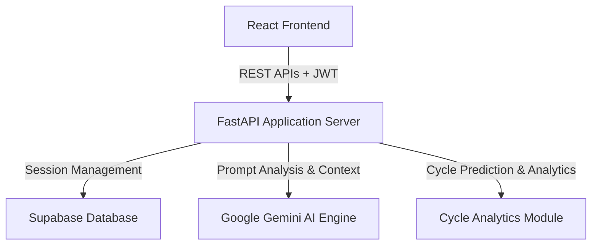
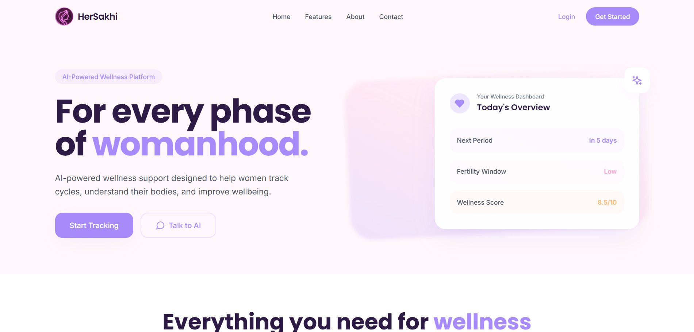
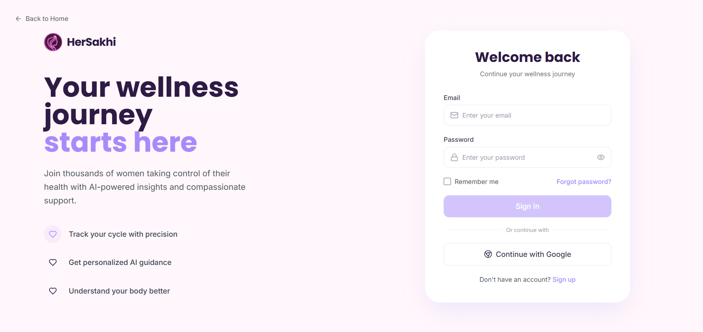
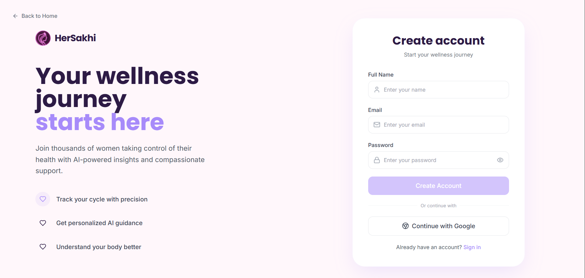
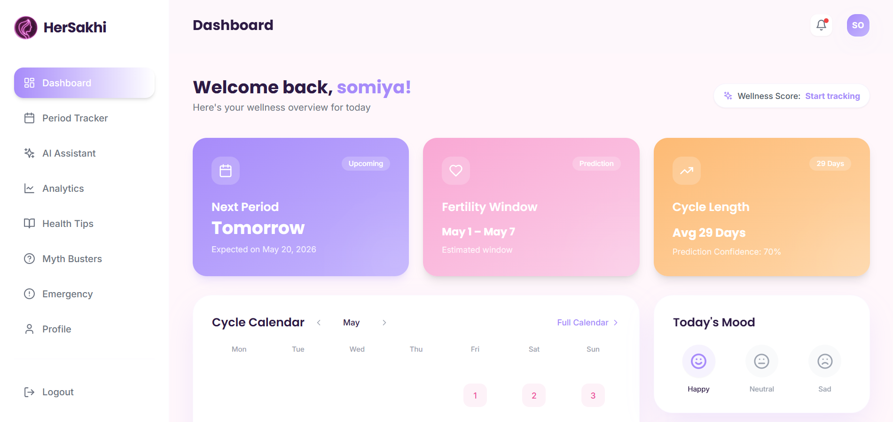
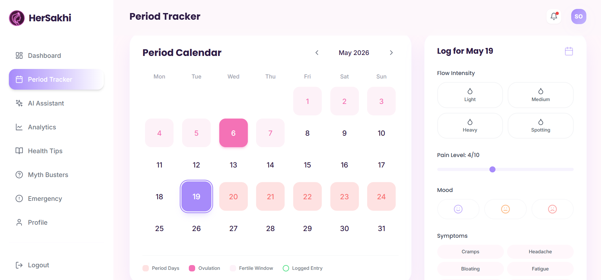
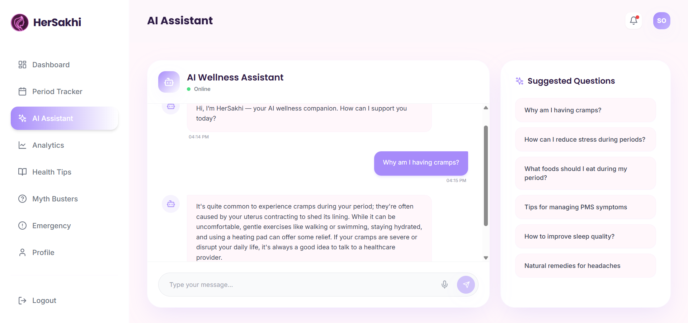
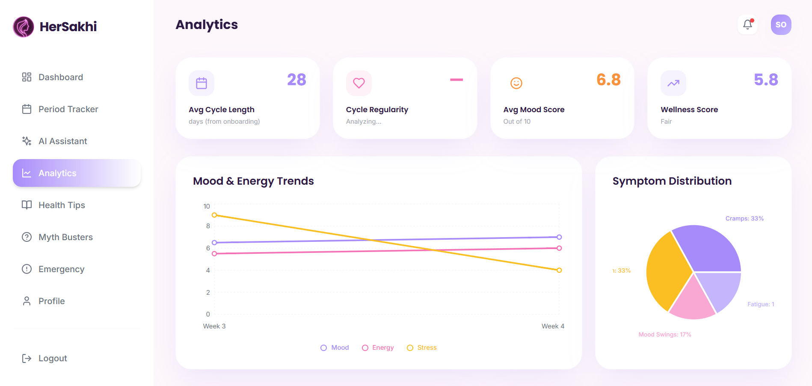
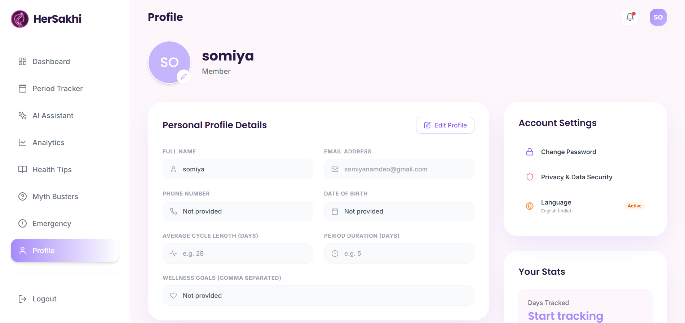
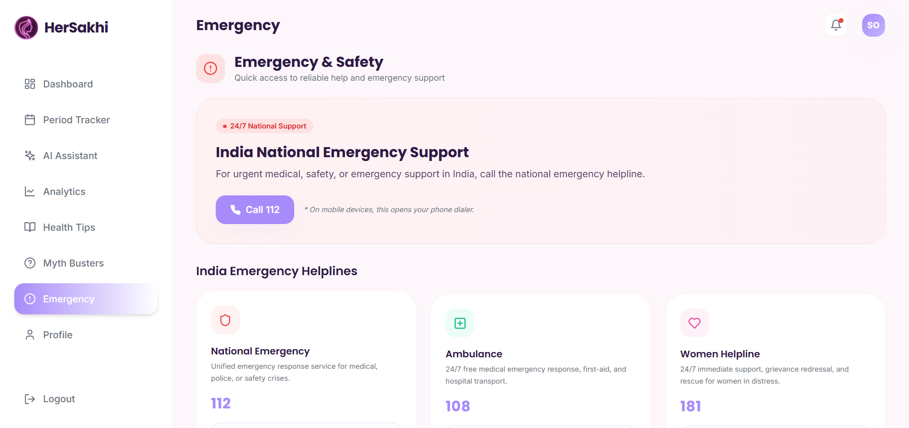

# HerSakhi: AI-Powered Women Wellness Platform

HerSakhi is a comprehensive, production-grade digital wellness application designed to support women's health through personalized analytics, cycle tracking, and machine learning insights. By combining data-driven cycle predictions with natural language AI support, HerSakhi provides users with an empathetic, secure, and intuitive self-care platform.

Live Frontend: https://her-sakhi-wellness-platform.vercel.app  
Live Backend: https://hersakhi-wellness-platform.onrender.com  
Repository: https://github.com/somiya-namdeo/HerSakhi-Wellness-Platform.git

---

## Project Overview

### Problem Solved
Traditional health tracking often focuses solely on static calendar logs, omitting complex physiological and emotional patterns. HerSakhi provides a unified, privacy-first wellness dashboard that integrates cycle tracking with real-time, context-aware AI support.

### Target Audience
HerSakhi is designed for women and individuals seeking a structured, secure, and data-driven approach to tracking their cycles, identifying emotional patterns, managing wellness indicators (sleep, stress, hydration), and receiving intelligent health guidance in an intuitive and supportive digital environment.

### Product Vision
To establish an open, accessible, and privacy-focused digital wellness ecosystem that bridges the gap between scientific health tracking and personalized, everyday care. HerSakhi aims to empower users to understand their bodies better through clear analytics, proactive AI insights, and reliable safety tools.

---

## Core System Architecture

The application utilizes a decoupled client-server architecture. The React frontend interacts with the FastAPI backend through secure, token-authorized REST APIs. User information, cycle histories, and wellness indicators are stored in Supabase, while conversational analysis is powered by the Google Gemini API.



---

## Technology Stack

### Frontend
* Core: React.js, Vite
* Styling: Tailwind CSS, Vanilla CSS
* State & Icons: Lucide React, LocalStorage persistence
* Build & Optimization: Rollup, PostCSS

### Backend
* Framework: FastAPI (Python)
* Server: Uvicorn
* Data Validation: Pydantic
* Security: JWT Authentication (python-jose), Password Hashing (passlib, bcrypt)

### Database & Third-Party APIs
* Database: Supabase PostgreSQL
* AI Model: Google Gemini API (google-generativeai)

### Infrastructure & Deployment
* Frontend Hosting: Vercel
* Backend Hosting: Render
* Database Hosting: Supabase Cloud

---

## Key Capabilities

### Secure Authentication System
Features secure account registration and authentication flows protected by secure JWT-based session authentication and high-entropy backend JWT validation.

### Period Tracking
An intuitive interface to log daily symptoms, flow intensity, pain levels, moods, and notes, storing data securely in PostgreSQL.

### Personalized Wellness Insights
Real-time analysis of hydration, sleep, energy, and stress indices, combined to generate a holistic daily wellness score.

### Health Analytics Dashboard
Interactive visualizations summarizing mood trends, symptom distributions, wellness radar indicators, and cycle length variations over time.

### AI-Powered Wellness Assistant
A custom-contextual chat interface powered by Google Gemini, capable of delivering accurate, private, and conversational health answers.

### Emergency & Safety Support
A dedicated safety panel featuring direct SOS controls, local Indian emergency hotlines, and location-aware Google Maps healthcare resource discovery.

---

## Screenshots

The following screenshots demonstrate the core system modules of the active HerSakhi platform:

### Landing Page


### Login Page


### Registration Page


### Dashboard Layout


### Period Tracking Screen


### AI Wellness Assistant


### Health Analytics Dashboard


### User Profile


### Emergency & Safety Panel


---

## Demonstration Video

A video walkthrough of the complete system functionality can be accessed here:

[Watch Demo Video](https://youtu.be/zDbNtHS8q1A)

---

## AI & Recommendation Engine

HerSakhi utilizes Google Gemini to provide privacy-first, context-aware wellness recommendations:

* **Anonymized Processing:** User-logged parameters are sanitized before querying the model, ensuring zero exposure of personally identifiable information (PII).
* **Clinical Guardrails:** System-level prompts prioritize safety by automatically surfacing medical consult warnings when critical symptoms or high pain logs are detected.

---

## Project Structure

```text
HerSakhi-Project/
├── backend/
│   ├── routes/
│   ├── services/
│   ├── utils/
│   ├── app.py
│   ├── requirements.txt
│   └── runtime.txt
├── src/
│   ├── api/
│   ├── assets/
│   ├── components/
│   ├── pages/
│   ├── App.jsx
│   ├── main.jsx
│   └── index.css
├── public/
├── README-assets/
│   ├── screenshots/
│   └── demo-video/
├── package.json
├── tailwind.config.js
└── README.md
```

---

## Local Development Setup

Follow these steps to run the complete HerSakhi system locally:

### Prerequisites
* Python 3.12 recommended
* Node.js 18 or higher
* Git

### Backend Setup

1. Navigate to the backend directory:
   ```bash
   cd backend
   ```

2. Create a virtual environment:
   ```bash
   python -m venv venv
   ```

3. Activate the virtual environment:
   * On Windows:
     ```bash
     venv\Scripts\activate
     ```
   * On macOS/Linux:
     ```bash
     source venv/bin/activate
     ```

4. Install the required dependencies:
   ```bash
   pip install -r requirements.txt
   ```

5. Create a `.env` file inside the `backend/` directory using these variables:
   ```env
   SUPABASE_URL=your_supabase_project_url
   SUPABASE_KEY=your_supabase_anon_public_key
   JWT_SECRET_KEY=your_custom_jwt_secret_signing_key
   GEMINI_API_KEY=your_google_gemini_api_key
   ```

6. Start the FastAPI development server:
   ```bash
   uvicorn app:app --reload
   ```

### Frontend Setup

1. Open a new terminal at the project root workspace directory.

2. Install the frontend dependencies:
   ```bash
   npm install
   ```

3. Create a `.env` file inside the root directory:
   ```env
   VITE_API_BASE_URL=http://127.0.0.1:8000
   ```

4. Launch the local Vite development server:
   ```bash
   npm run dev
   ```

5. Open your browser and navigate to `http://localhost:5173`.

---

## Deployment Architecture

### Frontend (Vercel)
The React application is compiled and deployed globally using Vercel's edge network, fetching dynamic data from Render and using HTTPS encryption for all browser-to-server traffic.

### Backend (Render)
The FastAPI backend is deployed on a Linux container environment hosted on Render. It processes incoming requests, enforces CORS policies, connects securely to Supabase PostgreSQL, and returns compressed JSON payloads.

---

## Future Roadmap
* **Offline Synchronization:** Implement service workers and IndexedDB to allow symptom logging and basic history retrieval in zero-connectivity environments.
* **On-Device Encrypted Backup:** Provide localized encrypted data downloads to allow users to preserve and control their wellness information offline.
* **Integrated Health Calendars:** Connect period predictions directly with external calendaring tools (Google Calendar, iCal) via custom secure feeds.

---

## Author
* Somiya Namdeo - Somiya-Namdeo

---

## Contribution
Contributions, suggestions, and improvements are welcome. Feel free to open issues or submit pull requests.
